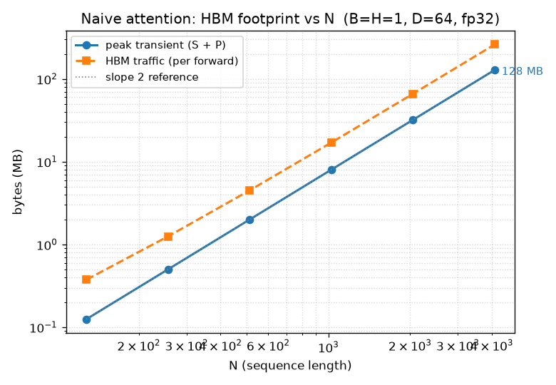

# Memory analysis: why naive attention is memory-bound

> **Status: rough draft — landed in M2. Finalized in M9** with measured DRAM
> throughput from Nsight Compute alongside the analytical numbers below.

This doc quantifies the HBM cost of the M2 naive baseline
(`csrc/attention_naive.cu`) and shows — from first principles, before running a
profiler — that it must be memory-bound past a modest `N`. The full theory is
in [`../theory/M2.md`](../theory/M2.md) §9–§10; this file is the *evidence*
that goes with the claim.

---

## 1. What we're counting

Two distinct quantities, both plotted in `docs/plots/naive_memory.png`:

- **Peak transient device allocation** — the size of the scratch buffers `S`
  and `P` that live simultaneously between kernels. Caller-provided tensors
  (`Q`, `K`, `V`, `O`) are excluded because they exist regardless of the
  algorithm.
- **Total HBM traffic** — sum of bytes read *and* written across the three
  kernel launches per forward pass. This is the number the roofline analysis
  in M9 will compare against `DRAM_bandwidth × runtime`.

Analytical only in M2 — no GPU profiling yet. Measured values arrive in M9.

---

## 2. The formulas

Per `(batch, head)` at fp32 (4 B/element), from `theory/M2.md` §9.1:

| Kernel        | Reads                | Writes         | Bytes touched |
|---------------|----------------------|----------------|---------------|
| `qk_matmul`   | `Q` + `K` = `2·N·D`  | `S` = `N²`     | `4·(2ND + N²)` |
| `row_softmax` | `S` = `N²`           | `P` = `N²`     | `4·(2N²)` |
| `pv_matmul`   | `P` + `V` = `N² + ND`| `O` = `N·D`    | `4·(N² + 2ND)` |
| **Total**     |                      |                | **`4·(4ND + 4N²)`** |

For `N ≫ D` the `4N²` term dominates → **quadratic in `N`.**

Peak transient allocation is simpler: `S` and `P` are both `B·H·N²` fp32
elements, held simultaneously → `8·B·H·N²` bytes total.

---

## 3. Numbers (canonical shape: `B=H=1, D=64, fp32`)

Sourced from `benchmarks/results/naive_memory.csv` (generated by
`benchmarks/naive_memory.py`).

| `N`   | `S` size | Peak transient (`S`+`P`) | Total HBM traffic |
|-------|----------|--------------------------|-------------------|
| 128   | 64 KB    | 128 KB                   | 384 KB            |
| 256   | 256 KB   | 512 KB                   | 1.2 MB            |
| 512   | 1 MB     | 2 MB                     | 4.5 MB            |
| 1024  | 4 MB     | 8 MB                     | 17 MB             |
| 2048  | 16 MB    | 32 MB                    | 66 MB             |
| 4096  | 64 MB    | **128 MB**               | **260 MB**        |

Double `N`, memory grows **4×**. That's the log-log slope-2 signature visible
in the plot:



---

## 4. Roofline argument

Why "memory-bound" isn't just a hunch:

- **Colab T4 peak fp32 compute:** ≈ 8.1 TFLOP/s (datasheet).
- **Colab T4 peak HBM bandwidth:** 320 GB/s (measured via `./build/hello`).
- **Ridge point:** ≈ 8100 / 320 ≈ **25 FLOP/byte** — arithmetic intensity at
  which compute peak = memory peak. Kernels *below* the ridge are memory-bound.

Arithmetic intensity of each M2 kernel (see `theory/M2.md` §10.1):

| Kernel        | AI (FLOP/byte) at `N=4096, D=64` | Bound |
|---------------|----------------------------------|-------|
| `qk_matmul`   | ≈ 0.03 | Memory-bound (≈ 800× below ridge) |
| `row_softmax` | ≈ 0.38 | Memory-bound (≈ 65× below ridge) |
| `pv_matmul`   | ≈ 0.50 | Memory-bound (≈ 50× below ridge) |

**Every M2 kernel sits at least an order of magnitude below the ridge.** That
means:

- Wall-clock time is set by HBM traffic, not by FLOP count.
- Adding more compute per byte would be free until we approach the ridge.
- The M4 win is not "faster arithmetic" — it's "same arithmetic, way less HBM
  traffic." Which is exactly what Flash Attention delivers.

---

## 5. Lower-bound runtime prediction

At `N=4096, D=64, B=H=1, fp32`:

```
260 MB HBM traffic  ÷  320 GB/s peak bandwidth  ≈  0.81 ms
```

This is the *floor* for the naive baseline on Colab T4 — any measured runtime
below this would indicate a bug (we're not moving the bytes we claim to). The
actual measured runtime will be higher (real bandwidth is < peak, kernel
launch overhead adds up, softmax has some serial cost per row). We'll pin the
gap in M9 with `ncu --set full` and reconcile the two numbers.

---

## 6. How M4 will fix this

FlashAttention v1 (M4) never materializes `S` or `P` in HBM. Its total HBM
traffic per `(b, h)` is approximately:

```
4 · (2ND + 2ND + ND) = 20ND bytes    (linear in N)
```

For `N=4096, D=64`: **5 MB** — a **52×** reduction from the naive 260 MB. Every
byte we're logging in `naive_memory.csv` today is a byte M4 will *not* touch.
This is the number the M10 hero result will freeze.

---

## 7. What this doc leaves for M9

Finalization tasks that live in `docs/nsight_comparison.md` and this doc's M9
revision:

- Replace analytical HBM traffic with **measured** `dram__bytes.sum` from
  `ncu --section MemoryWorkloadAnalysis`.
- Add per-kernel measured achieved bandwidth (GB/s) so we can compare to peak.
- Add a runtime column and confirm the analytical lower bound §5 is respected.
- Fold the roofline plot from M9 into this doc as a figure.

Nothing above changes the *shape* of the argument — the analytical numbers are
already tight enough to justify the M4 investment.
